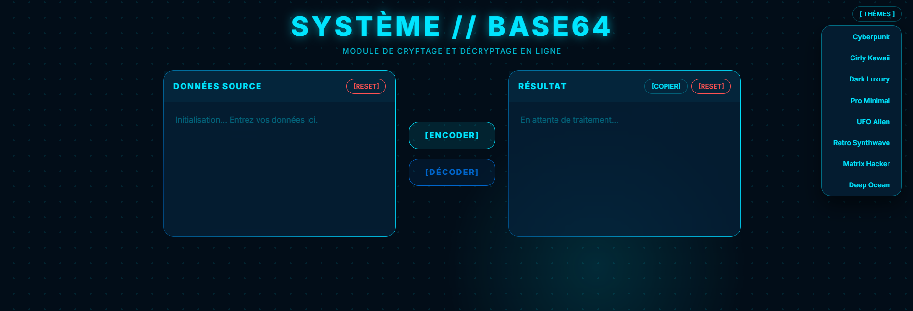

# ⚡ BASE64 Converter // Powered by BPM

> Convertisseur Base64 interactif et sécurisé (WAV/UTF-8), doté d'effets sonores générés en temps réel par **Web Audio API**, d'un effet machine à écrire et d'un moteur à 8 thèmes visuels.

🌐 **[Accéder au convertisseur en ligne](https://brival-m.github.io/BASE64_converter-by-BPM/)**  
📂 **[Dépôt GitHub](https://github.com/BRIVAL-M/BASE64_converter-by-BPM)**

---

## ✨ Fonctionnalités principales

* **Encodage & Décodage sécurisé UTF-8 :** Utilisation des API natives `TextEncoder` et `TextDecoder` pour éviter les erreurs de caractères spéciaux, émojis ou accents (contrairement au `btoa`/`atob` classique).
* **Effets sonores synthétisés (Web Audio API) :** Retour sonore rétro-futuriste généré mathématiquement à la volée (encodage, décodage, copie, effacement, changement de thème, erreurs). Aucun fichier audio externe chargé.
* **Effet Machine à écrire (Typewriter) :** Affichage progressif du résultat avec clic sonore dynamique à chaque caractère.
* **Moteur de 8 thèmes :** Switch visuel rapide (Cyberpunk, Kawaii, Luxury, Minimal, UFO, Retro, Matrix, Ocean) avec persistance dans le `localStorage`.
* **Presse-papier & Ergonomie :** Copie en un clic avec retour visuel et gestion des erreurs de saisie.
* **100 % Client-Side :** Fonctionne intégralement dans le navigateur, zéro serveur, zéro dépendance externe.

---

## 🛠️ Stack technique

* **HTML5** : Structure sémantique et accessible.
* **CSS3** : Variables CSS, Glassmorphism, animations et thématique dynamique.
* **JavaScript (Vanilla ES6+)** :
  * **Web Audio API** (`AudioContext`, `OscillatorNode`, `GainNode`) pour le moteur sonore.
  * **Web API** (`TextEncoder`, `TextDecoder`, `Clipboard API`, `localStorage`).

---

